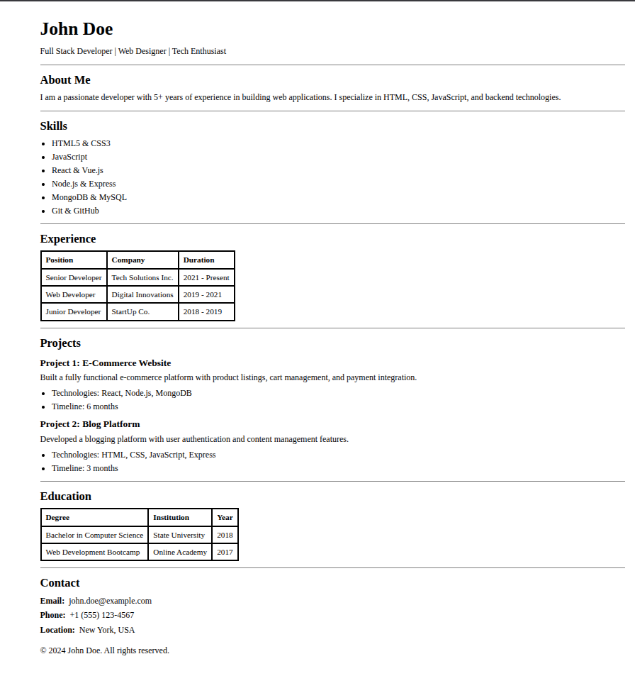

# Single-Page Resume Website

A simple, semantic HTML resume based on a provided design layout.

## Setup Instructions

1. Clone this repository: `git clone git@github.com:suryanva/HTML_ResumePage_Assignment.git`
2. Navigate to the project folder.
3. Open `index.html` in any web browser to view the resume.

## 📸 Screenshot

# My Project
You can view the live page here: [HTML Resume Page](https://suryanva.github.io/HTML_ResumePage_Assignment/)